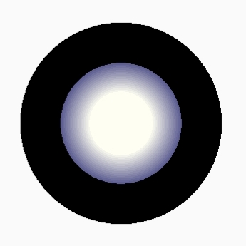

# JoystickView
A simple, customizable Android joystick that can be easily added to activities.

 

## How to include the library

**Gradle**

- **Project level `build.gradle`**
```gradle
allprojects {
    repositories {
        maven { url 'https://jitpack.io' }
    }
}
```
- **App level `build.gradle`**
```gradle
dependencies {
    implementation 'com.github.harry1453:joystick-view:v1.0'
}
```

## Using the library

Please see the `demoApp` directory for a demo app.

1. Add the `JoystickView` to your XML:

```XML
<com.harrysoft.joystickview.JoystickView
    android:layout_width="200dp"
    android:layout_height="200dp"
    android:id="@+id/my_joystick" />
```

2. Make your activity implement `JoystickView.JoystickListener`:

```JAVA
public class MainActivity extends AppCompatActivity implements JoystickView.JoystickListener {
    @Override
    public void onJoystickMoved(float xValue, float yValue, int id) {
        switch (id) {
            case R.id.my_joystick:
                Log.d("My Joystick App", "Joystick Moved! X value: " + xValue + " Y value: " + yValue);
                break;
        }
    }
}
```

3. Get an instance of the JoystickView and set the listener:

```JAVA
@Override
protected void onCreate(Bundle savedInstanceState) {
    super.onCreate(savedInstanceState);
    setContentView(R.layout.activity_main);
    
    JoystickView joystick = findViewById(R.id.my_joystick);
    joystick.setJoystickListener(this);
}
```

## Customization

To customize your joystick, just add 
```XML
xmlns:joystick="http://schemas.android.com/apk/res-auto"
```

to your layout, and add the desired XML to the JoystickView like this:

```XML
<com.harrysoft.joystickview.JoystickView
    ...
    joystick:hat_color="#abcdef"
    joystick:base_color="#111147"
    joystick:stick_shade_color="#afffff"                                    
    ... />
```


| XML Syntax  | Image | Default Value |
| ----------- | :-----------: | ----------- |
| joystick:hat_color="#000000" |  | #5E5E92 |
| joystick:base_color="#000000" |  | #303F9F |
| joystick:stick_shade_color="#F442D7" |  | #AFFFFF |
| joystick:draw_hat_shading="false" |  | true |
| joystick:draw_stick_shading="false" |  | true |
| joystick:draw_base="false" |  | true |
| joystick:ratio="20"<br/>(A lower ratio creates a smoother shading)|  | 5 |
